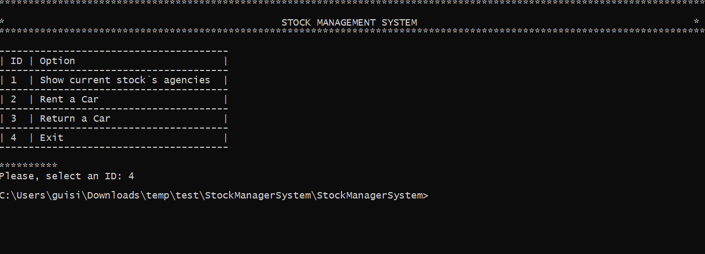

# Desafio de código
Olá!

Nesta etapa iremos avaliar a solução para um desafio prático, onde serão analisados aspectos desde o desenho da solução até o desempenho do código gerado. 
Como qualidade é um item que não abrimos mão de oferecer a nossos clientes, esteja livre para aplicar práticas que você utiliza no seu dia-a-dia de forma a construir código de qualidade.
Iremos avaliar a legibilidade e limpeza do código, a facilidade de evolução do código, aplicação de testes automatizados e arquitetura da solução.

## Orientações:

1) O código deverá ser feito na plataforma .Net, contudo, é livre a escolha do framework, podendo ser .net full ou .net core;

2) Poderá ser utilizado tanto Visual Studio tradicional quanto Visual Studio Code;

3) A solução somente será válida se acompanhada de testes unitários automatizados. Para tal, utilize soluções de mercado, como MSTest ou NUnit.

4) Não poderão ser utilizadas bibliotecas ou recursos online. Seu projeto somente poderá utilizar bibliotecas disponibilizadas no nuget.org. 

5) A solução deverá ser entregue acompanhada de uma breve descrição da solução proposta, justificando escolhas de padrões arquiteturais ou decisões de implementações escolhidas.

6) Será livre a escolha de abordagem de construção entre um console ou web/web api application, contudo, a mesma deve poder ser executada sem a necessidade de realização de passos manuais, como a instalação de produtos ou implantação. Resumindo, a solução deve ser testável diretamente via linha de comando ou através da IDE do Visual Studio.

7) Não será permitida a utilização de algum produto de banco de dados. Quaisquer armazenamentos necessários deverão ser realizados em memória, sem persistência em disco.

8) A única forma de recebimento da solução é através do repositório GitHub abaixo. Você deverá clonar a estrutura, criar um branch com seu nome, desenvolver sua solução e enviá-la por commit->push. Será necessário antes de iniciar, informar ao avaliador sua conta no github, para que seja concedida a permissão de contribuição.
Repositório: https://github.com/localizadevs/test.git

9) Você terá **3 dias** contados a partir do momento em que receber a descrição do teste por um de nossos avaliadores, para postar usa solução. Caso necessite de mais tempo, gentileza solicitar. Caso tenha alguma dúvida sobre o teste, entre em contato com o remetente do desafio.

10) Para termos um processo mais justo para todos os candidatos, por favor não compartilhe o desafio com outras pessoas.

Boa sorte e boa diversão!

# Solução
A solução foi desenvolvida em .Net Core utilizando a biblioteca NUNit para testes unitarios. A aplicação é do tipo Console e exibe as principais informações por tabelas.

### HOW TO RUN
`dotnet restore`
`dotnet build`

Para executar a aplicação, deve-se  executar o dotnet restore e dotnet build, antes.

 Ao executar deve-se indicar o full path do arquivo de estoque em CSV para ser parseado.
 
`dotnet run "%FULL_PATH_CSV_ESTOQUE%"`

